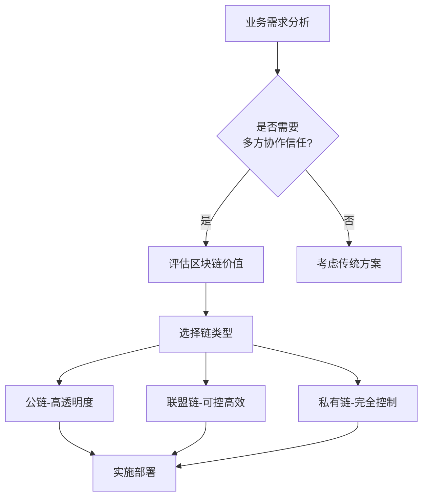

## 摘要
区块链技术通过分布式账本、加密算法和共识机制构建去中心化的信任体系。本文系统阐述其技术原理、典型特征、应用场景、当前挑战与发展趋势，为技术实践者与行业观察者提供结构化认知框架。

---

## 一、技术原理与核心特征

### 1.1 基本原理
区块链本质上是按时间顺序将数据区块以链式结构组合的分布式数据库，采用密码学保证数据传输和访问安全。每个区块包含一批交易记录，并通过哈希值与前序区块紧密相连。

### 1.2 核心特征
- **去中心化**：网络节点平等，无单一控制点
- **不可篡改**：历史记录一旦确认难以修改
- **透明可信**：所有节点共享相同账本
- **高可用性**：分布式架构避免单点故障

---

## 二、技术架构详解

### 2.1 系统组成
- **数据层**：区块结构、哈希函数、默克尔树
- **网络层**：P2P网络、传播机制、验证机制
- **共识层**：PoW、PoS、PBFT等共识算法
- **激励层**：发行机制、分配机制
- **合约层**：脚本代码、智能合约、算法机制
- **应用层**：DApp、钱包、浏览器等应用

### 2.2 共识机制对比
| 机制类型 | 代表 | 特点 | 适用场景 |
|---------|------|------|---------|
| PoW | 比特币 | 算力竞争、能耗高 | 公有链 |
| PoS | 以太坊2.0 | 权益证明、能效高 | 公有链 |
| DPoS | EOS | 委托代理、效率高 | 高性能公链 |
| PBFT | Hyperledger | 快速共识、节点少 | 联盟链 |

---

## 三、主流应用场景

### 3.1 金融领域
```
// 智能合约示例 - 简化支付通道
contract SimplePaymentChannel {
    address payable public sender;
    address payable public recipient;
    uint256 public expiration;
    
    function close(uint256 amount, bytes memory signature) public {
        // 验证签名并转账
        require(block.timestamp < expiration);
        require(isValidSignature(amount, signature));
        recipient.transfer(amount);
        selfdestruct(sender);
    }
}
```
- **跨境支付**：SWIFT系统替代方案，降低40%以上成本
- **供应链金融**：实现应收账款数字化，加速资金周转
- **数字资产**：证券型代币发行（STO），合规化资产上链

### 3.2 实体经济应用
- **产品溯源**：食品药品全流程追踪，提升供应链透明度
- **数字身份**：自主身份管理，减少重复KYC成本
- **版权保护**：创作时间戳+智能合约，实现自动化版税分配
- **共享经济**：去中心化平台，降低平台佣金至5%以下

### 3.3 政务与公益
- **选举投票**：不可篡改的电子投票系统
- **土地登记**：减少产权纠纷，登记效率提升60%
- **慈善捐赠**：全流程资金追踪，捐赠透明度100%

---

## 四、挑战与限制

### 4.1 技术瓶颈
1. **扩展性问题**
   - 比特币：7 TPS，确认时间10分钟
   - 以太坊：15-30 TPS，Gas费波动大
   - 解决方案：Layer2、分片、侧链技术

2. **隐私保护**
   - 公链数据完全公开
   - 零知识证明（ZKP）计算成本高
   - 同态加密性能限制

3. **互操作性**
   - 跨链通信协议不统一
   - 资产跨链存在安全隐患
   - Polkadot、Cosmos生态仍在发展

### 4.2 非技术障碍
- **监管不确定性**：全球监管标准差异大
- **能源消耗**：比特币年耗电约100 TWh（2023年）
- **用户体验**：私钥管理复杂，交易确认慢
- **人才缺口**：复合型区块链人才稀缺

---

## 五、发展趋势

### 5.1 技术演进方向
```
未来区块链架构 = 模块化设计 + 专业化分工
├── 数据可用性层（DA Layer）
├── 共识层（Consensus Layer）
├── 执行层（Execution Layer）
└── 结算层（Settlement Layer）
```

### 5.2 产业融合趋势
- **区块链+AI**：训练数据确权、模型共享激励
- **区块链+IoT**：设备身份认证、自动微支付
- **区块链+5G**：边缘计算节点、去中心化网络
- **区块链+元宇宙**：数字资产互通、虚拟经济底层

### 5.3 主流公链定位分化
| 链 | 核心定位 | 技术特色 |
|---|---------|---------|
| 比特币 | 数字黄金 | PoW、最安全、最去中心化 |
| 以太坊 | 世界计算机 | EVM、最大生态、POS转型 |
| Solana | 高性能链 | POH历史证明、高TPS |
| Cardano | 科研驱动 | 形式化验证、分阶段开发 |

---

## 六、实践建议

### 6.1 企业应用评估框架


### 6.2 实施路线图
**第一阶段（0-6个月）**
- 确定业务场景与痛点
- 完成概念验证（PoC）
- 小范围试点测试

**第二阶段（6-18个月）**
- 最小可行产品（MVP）上线
- 技术架构优化
- 合规风险评估

**第三阶段（18-36个月）**
- 生态扩展
- 跨链集成
- 规模化应用

### 6.3 开发者学习路径
- **新手阶段（1-3个月）**
  - 掌握Solidity/JavaScript基础
  - 完成Cryptozombies等入门教程
  - 部署第一个智能合约到测试网

- **进阶阶段（3-12个月）**
  - 学习DeFi协议源码
  - 掌握安全审计基础知识
  - 参与开源项目贡献

- **专家阶段（1年以上）**
  - 深入理解共识算法
  - 掌握零知识证明等高级密码学
  - 能够设计复杂系统架构

---

## 七、未来展望

### 7.1 短期（1-2年）
- 主流公链完成扩容升级
- Layer2解决方案大规模应用
- 监管框架逐步明晰
- 企业级应用案例显著增加

### 7.2 中期（3-5年）
- 跨链互操作性基本实现
- 隐私计算技术成熟应用
- 数字人民币等CBDC广泛使用
- Web3用户达到10亿规模

### 7.3 长期（5-10年）
- 价值互联网基础设施形成
- 传统金融与DeFi深度融合
- DAO成为重要组织形式
- 区块链成为基础技术像今天的互联网

---

## 总结
区块链技术仍处快速发展期，其在建立数字信任、提高协作效率方面具有独特价值。应用成功的关键在于选择合适场景、平衡去中心化程度与性能需求，并持续关注监管发展。建议从业者保持技术敏锐度，同时注重解决实际问题而非追逐概念热点。

---